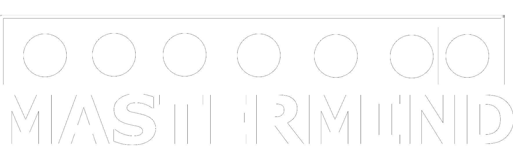

---

---

## Contributors
| [LarsBuergerr](https://github.com/LarsBuergerr)  |  [Smokey95](https://github.com/Smokey95) | 
|---|---|
|  |   |

---

<!--- BRANCH 07 ONLY --->
## 07-Design Pattern Info

The following pattern are implemented:
### Strategy:
The strategy pattern was used to select a gamemode according to userinput. See the implementation [here](https://github.com/LarsBuergerr/mastermind/blob/07-DesignPattern/src/main/scala/de/htwg/se/mastermind/util/GameMode.scala)

### Factory:
The factory pattern replaces the original enum declaration of the stones. To show the difference the game-stones are implemented using the pattern, the hint-stones are still implemented as enum. See the implementation [here](https://github.com/LarsBuergerr/mastermind/blob/07-DesignPattern/src/main/scala/de/htwg/se/mastermind/model/Stone.scala)

### State:
The state pattern was used to keep track over current game state. There are events defined to switch the state of a game instance and methods to check the current state. See the implementation of the states [here](https://github.com/LarsBuergerr/mastermind/blob/07-DesignPattern/src/main/scala/de/htwg/se/mastermind/model/State.scala). The Events are defined [here](https://github.com/LarsBuergerr/mastermind/blob/07-DesignPattern/src/main/scala/de/htwg/se/mastermind/util/Event.scala). To switch between states there is a handler (called request) implemented in game class [here](https://github.com/LarsBuergerr/mastermind/blob/07-DesignPattern/src/main/scala/de/htwg/se/mastermind/model/Game.scala)

### Chain of Responsibility:
The Cain-of-Responsibility is used so analyze users input. See the implementation [here](https://github.com/LarsBuergerr/mastermind/blob/07-DesignPattern/src/main/scala/de/htwg/se/mastermind/util/Request.scala) and in the game class

---

## Description

      ERROR 404 (DescriptionNotFound)